# **Ruff Road Home**

*Ruff Road Home* began as part of an elective Game Design class at Denison University. The game was created by the following contributors:

* Caroline Cavalier
* Oghap Kim
* Annie Pfuefer
* Phuong Le

## **Game Overview**

*Ruff Road Home* is a lighthearted, nostalgic platformer that follows the journey of a dog trying to find its way back home. Players will guide a lovable pup through a series of exciting, progressively challenging levels filled with action, puzzles, and heartwarming moments. From leaping over moving platforms to dodging squirrel attacks, every moment is packed with fun and adventure!

## **Gameplay Mechanics**

* **Progressive Learning Curve**:
  Each level introduces a new skill or mechanic that players must master in order to progress. As the game continues, the challenges get tougher, but with each new skill, players will feel a natural progression in their abilities.

* **Moving Platforms & Object Collection**:
  Early levels help players get familiar with platforming and object collection mechanics. Players will need to collect keys at specific points in the level to unlock doors and continue their journey.

* **Shooting Mechanics**:
  As players advance, they’ll encounter enemies (such as squirrels) that shoot projectiles. Players must dodge or counter these attacks to survive. This introduces an action mechanic that grows more complex as the game progresses.

* **Time Mode & Speed Challenges**:
  Some levels include time-based challenges that test players’ reflexes and adaptability. These speed challenges will push players to engage more deeply with the game as they progress toward the final levels.

* **Theme Consistency**:
  Dogs remain central to the experience. The theme is reinforced through visuals, sound design, and interactive elements, such as collecting dog treats instead of traditional coins.

* **Number of Lives**:
  Players are given a set number of lives. If they lose all their lives, they must start over from the first level. This adds an element of challenge and encourages players to learn from their mistakes.

## **Running the Game Locally**

To try out *Ruff Road Home* on your local machine, follow these steps:

1. **Clone the repository**:

   ```bash
   git clone git@github.com:Phuong-Le-NN/Way_Back_Home_Game.git
   ```

2. **Navigate to the appropriate folder**:
   Change your working directory to `2D_Platformer/TrialToLoadScene`:

   ```bash
   cd 2D_Platformer
   cd TrialToLoadScene
   ```

3. **Start the local server**:
   Spin up the local server with:

   ```bash
   python3 -m http.server 8080
   ```

4. **Play the game**:
   Open your web browser and go to:

   ```
   http://127.0.0.1:8080
   ```

   We recommend playing in **full screen** :")


## **Game Aesthetic**
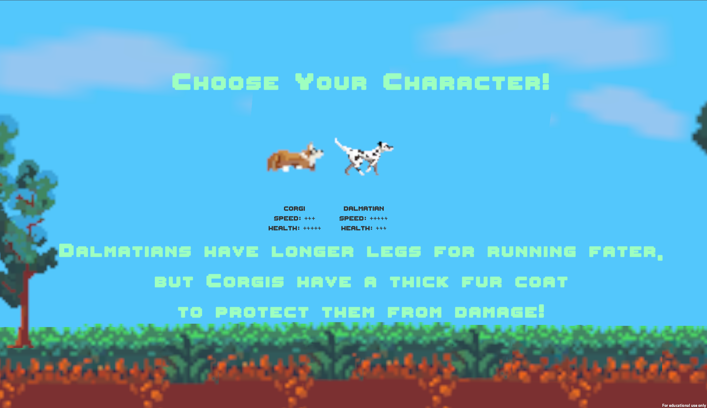
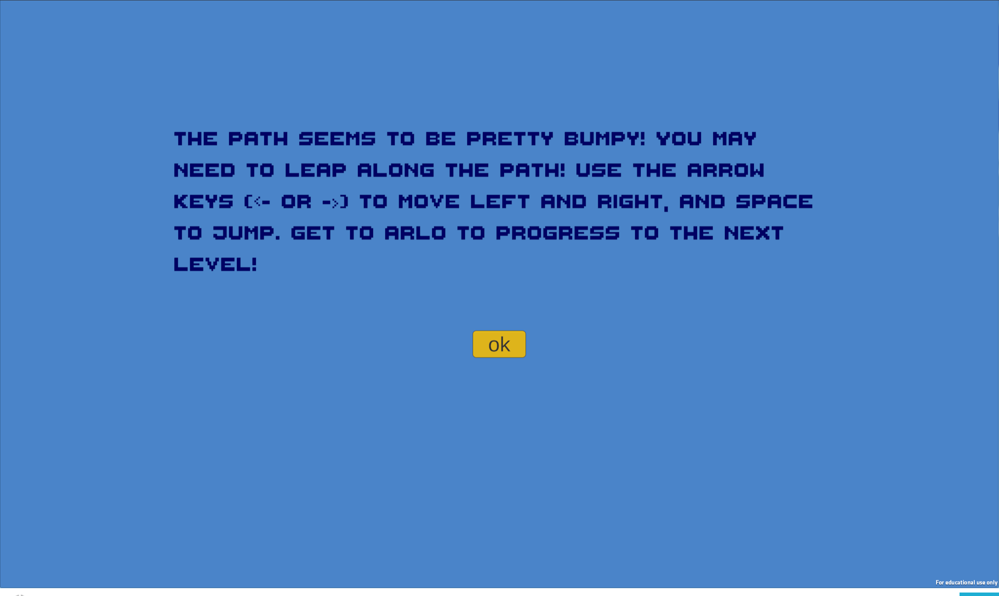
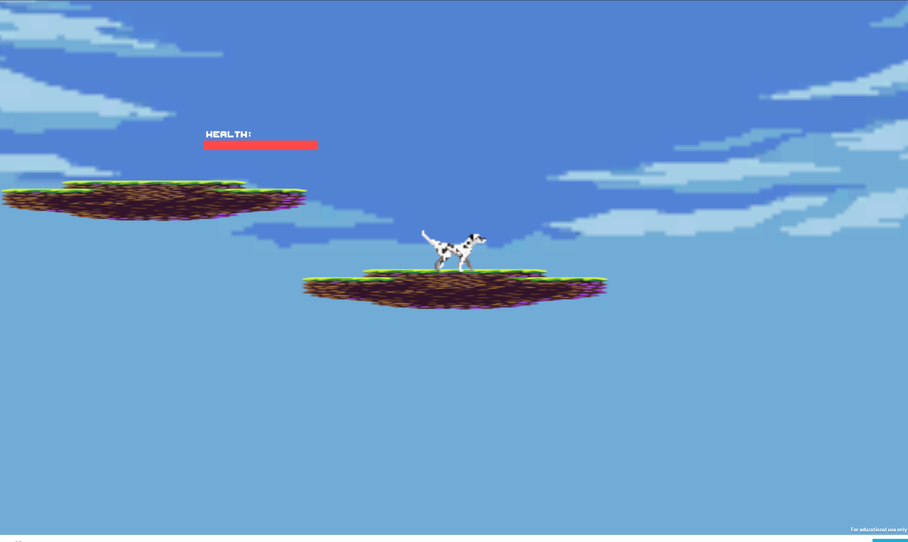
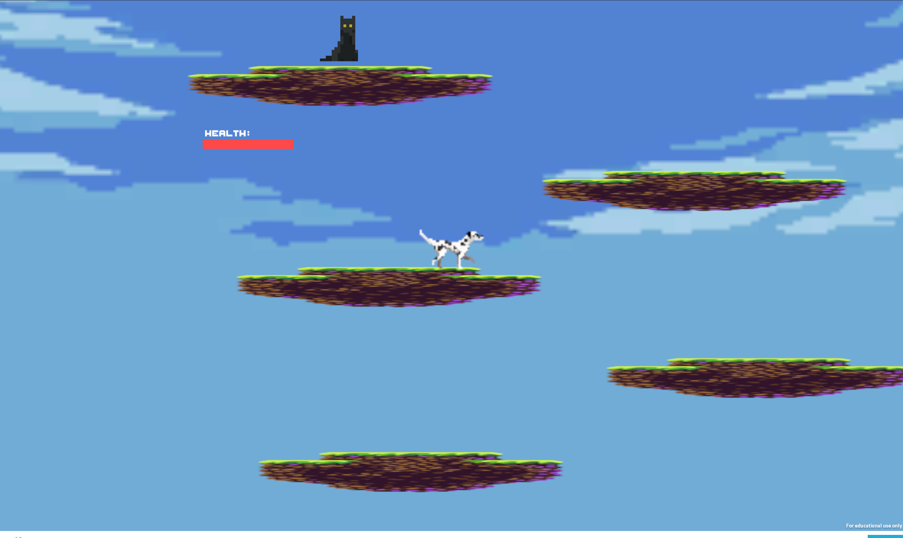
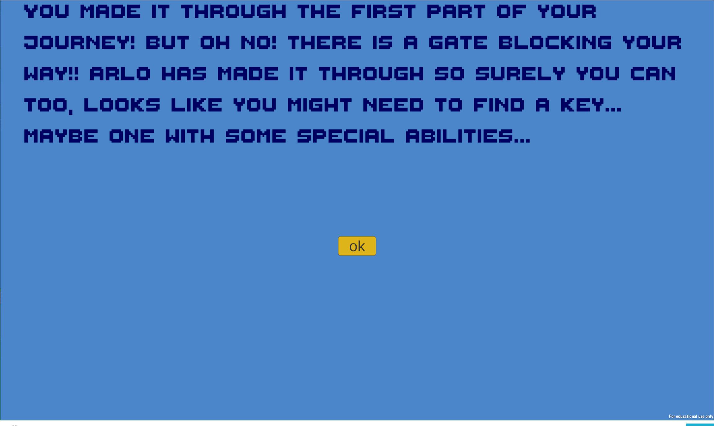
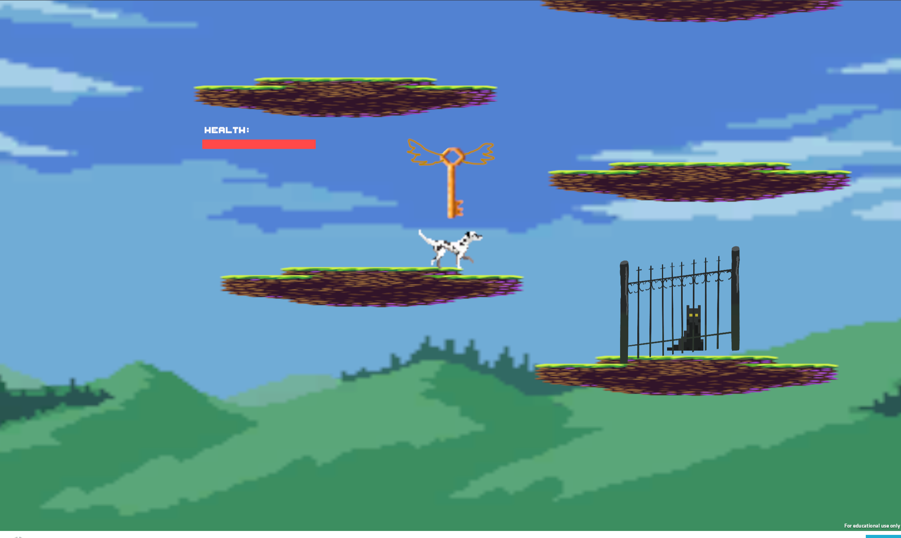
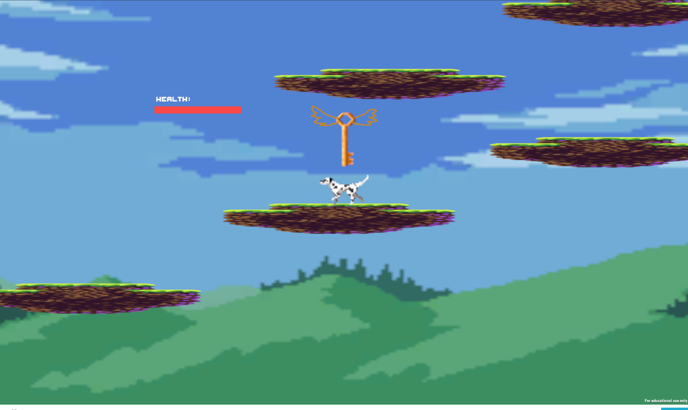
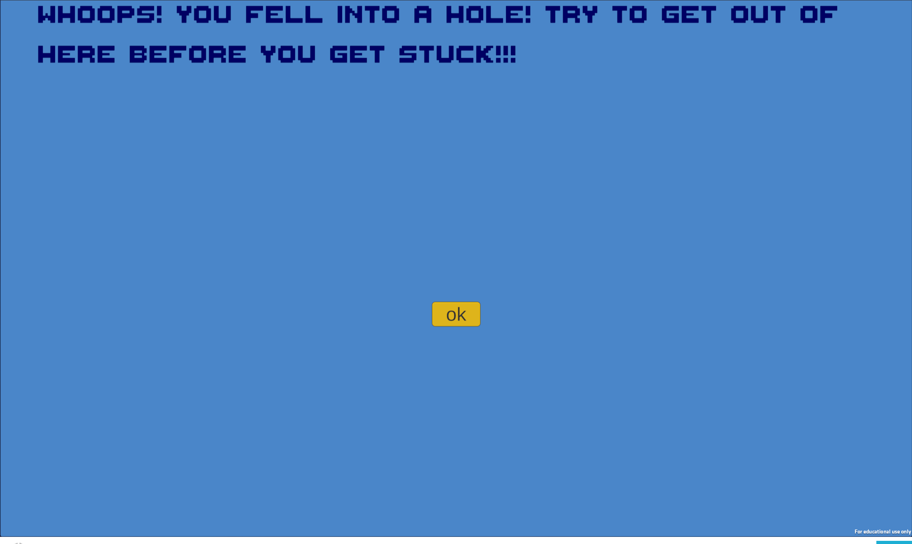
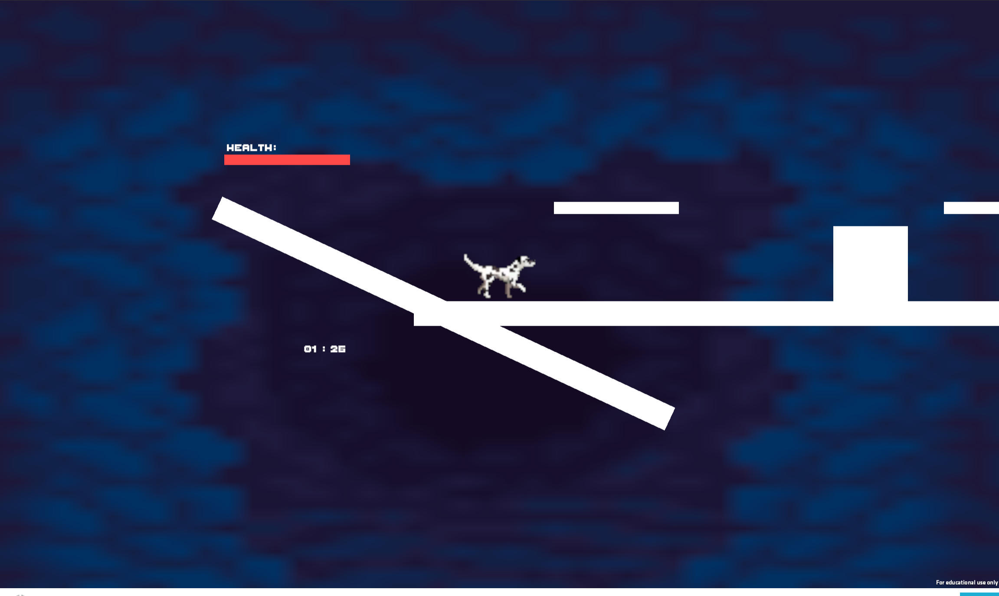
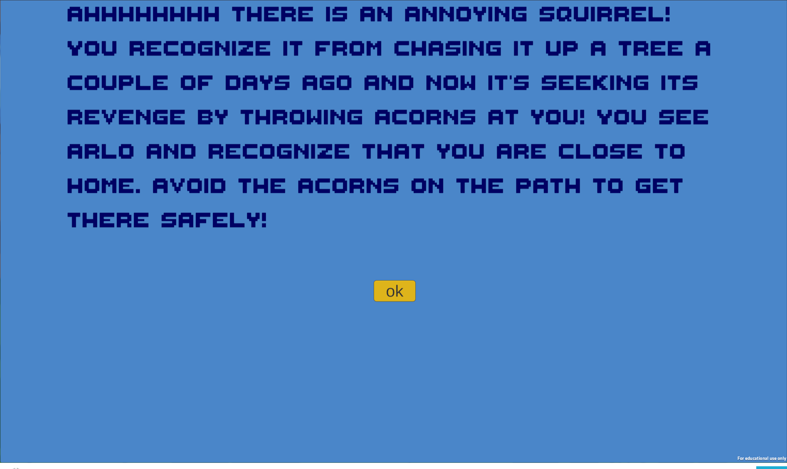
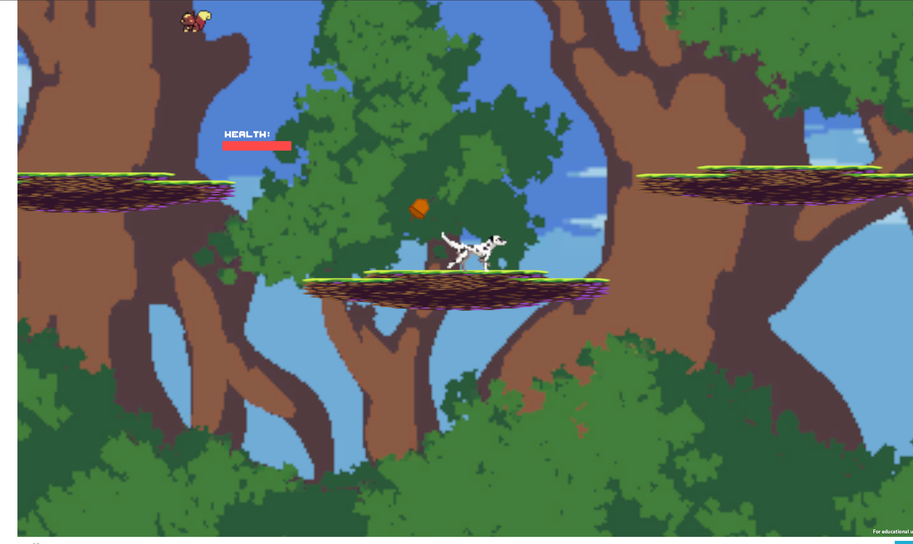
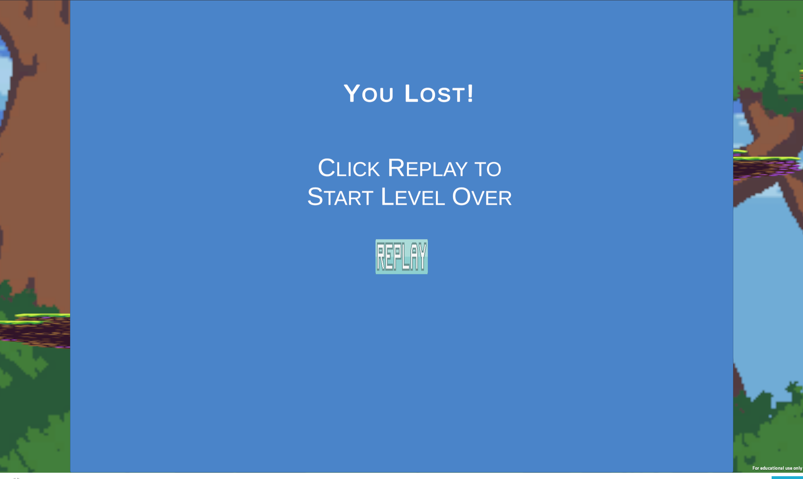
